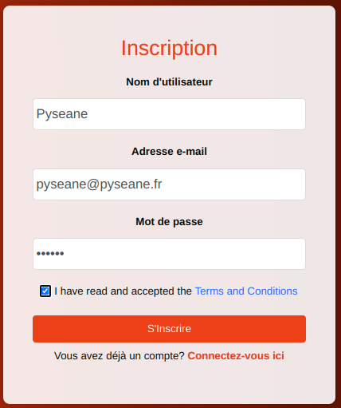
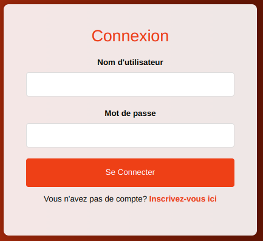
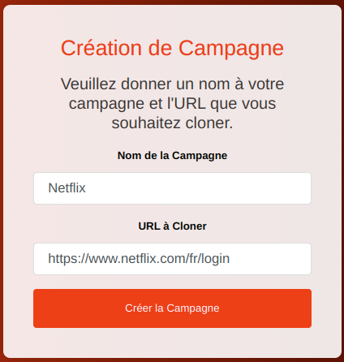
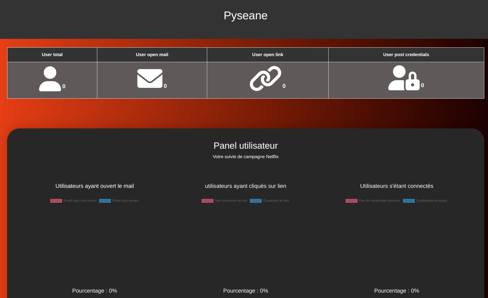
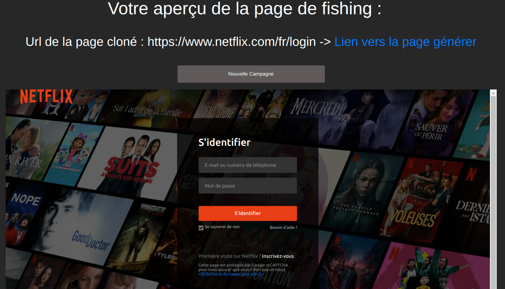
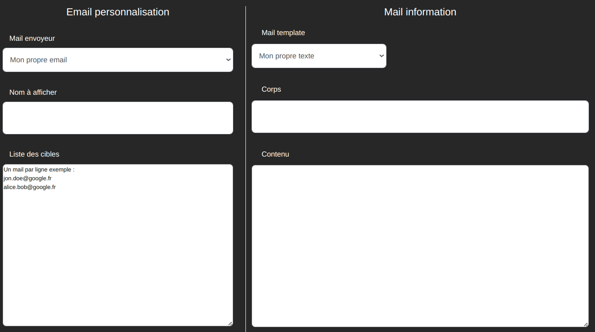

Développé par Remi TANG, Jeremi DESSERT, Nicolas MOLINA.

# Pyseane - Campagne de phishing
Dans le but d'une campagne de phishing, Pyseane permet de de gérer une campagne de phishing en passant de la création de la page web de phishing, de l'envoie de mail au utilisateurs jusqu'au suivi des cliques ou les rentrées d'informations d'authentifications sur le site falsifié.

#### Buts et objectifs
- Créer une campagne de phishing rapidement
- Assurer le suivi des hammeçonnages en temps réels

#### Pourquoi utiliser Pyseane
- Création automatique du site internet à dupliquer
- Interface utilisateur permettant d'envoyer les mails directement avec le lien de phishing
- Suivre la campagne en temps réel

## Installation de l'environnement

#### Se déplacer dans le bon répertoire
```
cd pyseane
```

#### Donner les droits d'execution et lancer le fichier de config permettant d'installer les dépendances
```
chmod +x config.sh
sudo ./config.sh
```

Ce fichier va installer python3, les dépendances fichiers de python puis docker.

## Ouverture et fermeture de l'application

#### Lancer l'application avec ces commandes
```
sudo docker-compose up -d
python3 manage.py makemigrations
python3 manage.py migrate
python3 manage.py runserver
```

Une fois lancé, il faudra ouvrir un navigateur et se connecter sur `localhost:8000`.

#### Fermer l'application avec le fichier down
```
sudo docker-compose down
```

## Utilisation de l'outil

#### 1. Creation d'un compte

[](img/Inscription.png)

Il faut donner un nom d'utilisateur, une adresse e-mail et un mot de passe.

#### 2. Connexion à votre compte

[](img/Connexion.png)

#### 3. Creation de la campagne de phishing

[](img/Campagne.png)

Il faut rentrer comme le nom de la campagne et la page à cloner. De préference, il faut mettre une page avec un formulaire.

#### 4. Accès à la page principale

[](img/Dasboard.png)

A travers cette page, vous pouvez voir le nombre de personne ayant ouvert le mail, cliqué sur le lien, et rentré ses identifiants de connexion.


#### 5. Voir la page qui a été cloné

[](img/Phishing.png)

Sur cette page, vous pouvez créer une autre campagne de phishing ou à quoi ressemble la nouvelle page cloné.


#### 6. Envoie de mail

[](img/Mail.png)

Sur cette page, vous pouvez rentrer les destinataires de mail avec le contenu du mail avec le lien de phishing.


